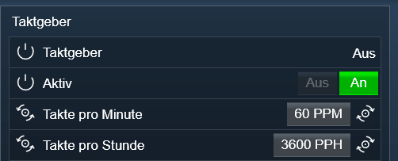

# CyclicClock

Symcon Modul:

- __CyclicClock__ 

	Dieses Modul stellt in Symcon einen Taktgeber zur Verfügung. Eine Bool'sche Variable wechselt im einstellbarem Zyklus den Wert.

	

	__[Weitere Dokumentation](CyclicClock)__